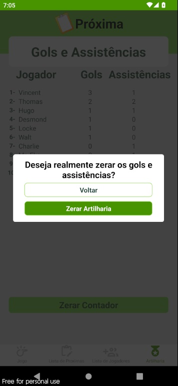

# Futebol Amigos App

Um aplicativo mobile para organizar partidas de futebol entre amigos, substituindo a tradicional prancheta.

## Funcionalidades Principais

- **Lista Geral de Jogadores:**
  - Adicione jogadores à lista geral.

- **Banco de Reservas Dinâmico:**
  - Mova jogadores para o banco de reservas e organize-os livremente para evitar panelinhas.

- **Seleção de Jogadores:**
  - Escolha e adicione jogadores em ordem de fila para cada posição no time.

- **Marcação de Gols e Assistências:**
  - Registre gols e assistências durante a partida, automaticamente atualizando estatísticas individuais.

## Instalação

### Android

1. Faça o download do APK mais recente do [Aplicativo](https://github.com/Emerson2342/proxima-futebol/releases/).
2. Instale o APK no seu dispositivo Android.

### iOS

Atualmente não suportado.

## Como Usar

- **Configuração Inicial:**
  - Configure as preferências do jogo, como número de jogadores e duração da partida.
  - Só é possível alterar a quantidade de jogadores com ambos os times limpos.

- **Durante a Partida:**
  - Adicione jogadores novos à lista de jogadores na terceira screen.
  - Para iniciar o sorteio, selecione os jogadores que vão jogar para o banco de reservas.
  - No Banco de Reservas, caso deseje, misture os jogadores para sorteá-los.
  - Na tela inicial, vai adicionando clicando na seta verde e para remover na seta vermelha, eles serão adicionados em forma de fila, primeiro do Reservas entra e quando removido do time, entra no final da lista de reservas.
  - Marque gols e assistências diretamente pelo aplicativo.
  - Ao finalizar as partidas, é recomendado limpar os times e o banco de reservas.

## Licença

-**Suporte**
    Para suporte ou feedback, entre em contato via WhatsApp: +55 (61) 99835-4398 (https://wa.me/5561998354398) ou pelo email: lyncoln_erc@hotmail.com

---
2024 | Desenvolvido por Emerson Ribeiro

## Capturas de Tela

 | 
|:---:|:---:|
| 
|:---:|:---:|
| 
|:---:|:---:|
| 
|:---:|:---:|
| 

